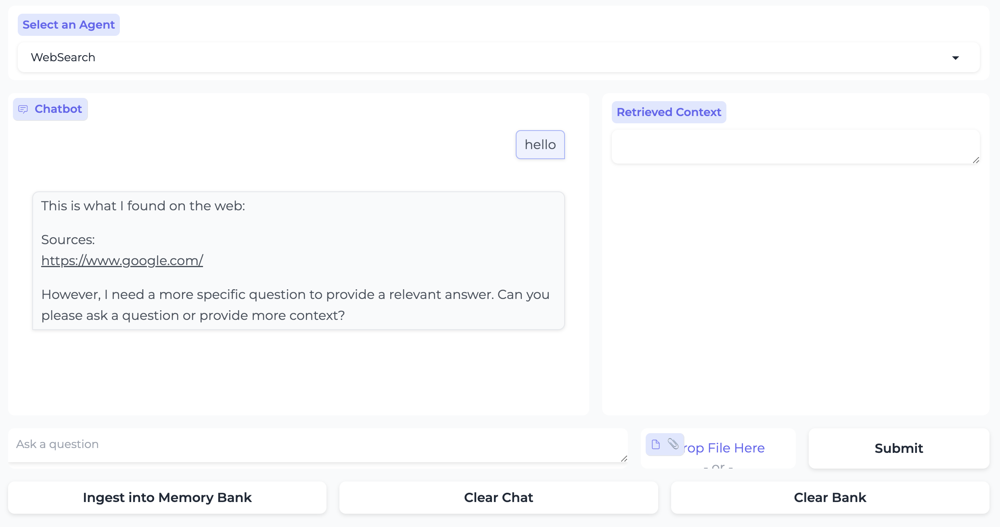

# Llama as a System

This repo allows you to run Llama 3.1 as a system capable of performing "agentic" tasks like:

- Breaking a task down and performing multi-step reasoning.
- Ability to use tools
  - built-in: the model has built-in knowledge of tools like search or code interpreter
  - zero-shot: the model can learn to call tools using previously unseen, in-context tool definitions

Additionally, we would like to shift safety evaluation from the model-level to the overall system level. This allows the underlying model to remain broadly steerable and adaptable to use cases which need varying levels of safety protection.

One of the safety protections is provided by Llama Guard. By default, Llama Guard is used for both input and output filtering. However, the system can be configured to modify this default setting. For example, it is recommended to use Llama Guard for output filtering in situations where refusals to benign prompts are frequently observed, as long as safety requirements are met for your use case.

> [!NOTE]
> The API is still evolving and may change. Feel free to build and experiment, but please don't rely on its stability just yet!


**LLama Agentic System Installation and Setup Guide**
=============================================

**Create a Conda Environment**
-----------------------------

Create a new conda environment with the required Python version:
```bash
ENV=agentic_env
with-proxy conda create -n $ENV python=3.10
cd <path-to-llama-agentic-system-repo>
conda activate $ENV
```

Note that you can also install this simply as a python [package](https://pypi.org/project/llama-agentic-system/) by using `pip install llama-agentic-system`.

**Creation of simple virtual environments**
-----------------------------
#### In Linux

```bash
# Create and activate virtual environment
python3 -m venv venv
source venv/bin/activate

# Install the package
pip install llama-agentic-system
```

#### For Windows

```bash
# Create and activate virtual environment
python -m venv venv
venv\Scripts\activate  # For Command Prompt
# or
.\venv\Scripts\Activate.ps1  # For PowerShell
# or
source venv\Scripts\activate  # For Git

# Install the package
pip install llama-agentic-system
```

**Running FP8**
---------------------------
If you want to run with on-the-fly fp8 quantization, you need `fbgemm-gpu` package which requires torch >= 2.4.0 (currently only in nightly, but releasing shortly...). You can find the fp8_requirements in the llama-toolchain repository at https://github.com/meta-llama/llama-toolchain/blob/main/fp8_requirements.txt.

```bash
ENV=fp8_env
conda create -n $ENV python=3.10
conda activate $ENV

pip3 install -r fp8_requirements.txt
```

**Install as a Package**
-------------------------

Install the package using pip:
```bash
pip install -e .
```
This will install all the dependencies as needed.

We also need bubblewrap to run code executor as a tool for the agent.
Install [bubblewrap](https://github.com/containers/bubblewrap)

**Test Installation**
--------------------

Test the installation by running the following command:
```bash
llama --help
```
This should print the CLI help message.

```bash
usage: llama [-h] {download,inference,model,agentic_system} ...

Welcome to the LLama cli

options:
  -h, --help            show this help message and exit

subcommands:
  {download,inference,model,agentic_system}
```

This Llama CLI will help you to do the following

- Download the latest Llama3.1 models from HuggingFace
- Configure and start a inference server on your local machine
- Configure and run apps that showcase agentic systems built using the Llama Stack APIs.

Lets go step by step and finish the setup process,

**Download Checkpoints (or use existing models)**
----------------------------------------------

Download the required checkpoints using the following commands:
```bash
# download the 8B model, this can be run on a single GPU
llama download llhf/Meta-Llama-3.1-8B-Instruct

# you can also get the 70B model, this will require 8 GPUs however
llama download llhf/Meta-Llama-3.1-70B-Instruct

# llama-agents have safety enabled by default. For this you will need
# safety models -- Llama-Guard and Prompt-Guard
llama download llhf/Prompt-Guard-86M --ignore-patterns original
llama download llhf/Llama-Guard-3-8B --ignore-patterns original
```
**Important:** Set your environment variable `HF_TOKEN` or pass in `--hf-token` to the command to validate your access. You can find your token at [https://huggingface.co/settings/tokens](https://huggingface.co/settings/tokens).

> **Tip:** Default for `llama download` is to run with `--ignore-patterns *.safetensors` since we use the `.pth` files in the `original` folder. For Llama Guard and Prompt Guard, however, we need safetensors. Hence, please make sure to run with `--ignore-patterns original` so that safetensors are downloaded and `.pth` files are ignored.


**Configure Inference Server Config**
------------------------------------

Configure the inference server config by running the following command:
```bash
llama inference configure
```
Follow the system prompts to fill in checkpoints, model_parallel_size, etc. When asked for the checkpoint directory for the model, provide the local model path from the previous step. This writes configs to `~/.llama/configs/inference.yaml`.

> **Tip:** Note that while you download HF checkpoints, we rely on the original `.pth` files which are stored in the `original` folder. So make sure to use `<path>/original` for checkpoint directory if necessary.

You should see output like
```bash
YAML configuration has been written to <HOME_DIR>/.llama/configs/inference.yaml
```

All configurations as well as models are stored in `~/.llama`

**Run Inference Server**
-----------------------

Run the inference server by running the following command:
```bash
llama inference start
```
This will start an inference server which runs the model on `localhost:5000` by default.

> **Tip:** Inference config is in `~/.llama/configs/inference.yaml`. Feel free to increase `max_seq_len` or change checkpoint directories as needed.

Output will be of the form
```bash
Loading config from : ~/.llama/configs/inference.yaml
Yaml config:
------------------------
inference_config:
  impl_config:
    impl_type: inline
    checkpoint_config:
      checkpoint:
        checkpoint_type: pytorch
        checkpoint_dir: <HOMEDIR>/local/checkpoints/Meta-Llama-3.1-8B-Instruct-20240710150000//
        tokenizer_path: <HOMEDIR>/local/checkpoints/Meta-Llama-3.1-8B-Instruct-20240710150000//tokenizer.model
        model_parallel_size: 1
        quantization_format: bf16
    quantization: null
    torch_seed: null
    max_seq_len: 2048
    max_batch_size: 1

------------------------
Listening on :::5000
INFO:     Started server process [2412753]
INFO:     Waiting for application startup.
> initializing model parallel with size 1
> initializing ddp with size 1
> initializing pipeline with size 1

Loaded in 13.86 seconds
NCCL version 2.20.5+cuda12.4
Finished model load YES READY
INFO:     Application startup complete.
INFO:     Uvicorn running on http://[::]:5000 (Press CTRL+C to quit)
```
This server is running a Llama model locally.

> **Tip** You might need to use the flag `--disable-ipv6` to  Disable IPv6 support

Now that the inference server is setup, the next thing would be to run an agentic app using the llama-agentic-system APIs.

We have build sample scripts, notebooks and a UI chat interface ( using [Mesop]([url](https://google.github.io/mesop/)) ! ) to help you get started.

**Configure Agentic System**
---------------------------

Configure the agentic system config by running the following command:
```bash
llama agentic_system configure
```
Follow the system prompts. When asked for a model checkpoint directory, provide the local model path from the previous step.
This writes a config to `~/.llama/configs/agentic_system/inline.yaml`.

This config will look something like this
```bash
agentic_system_config:
  impl_config:
    impl_type: inline
    inference_config:
      impl_config:
        impl_type: remote
        # the url to the inference server
        url: http://localhost:5000
  # Safety shields
  safety_config:
    llama_guard_shield:
      model_dir: <path>
      excluded_categories: []
      disable_input_check: False
      disable_output_check: False
    prompt_guard_shield:
      model_dir: <path>

# Use this config to change the sampling params
# when interacting with an agent instance
sampling_params:
  temperature: 0.0
  strategy: "top_p"
  top_p: 0.95
  top_k: 0
```

**Add API Keys for Tools**
---------------------------------------------
In your repo root directory, add API Keys for tools.
Tools that model supports which needs API Keys --
- Brave for web search (https://api.search.brave.com/register)
- Wolfram for math operations (https://developer.wolframalpha.com/)


> **Tip** If you do not have API keys, you can still run the app without model having access to the tools.


**Start an App and Interact with the Server**
---------------------------------------------

Start an app (inline) and interact with it by running the following command:
```bash
mesop app/main.py
```
This will start a mesop app and you can go to `localhost:32123` to play with the chat interface.



Similar to this main app, you can also try other variants
- `PYTHONPATH=. mesop app/chat_with_custom_tools.py`  to showcase how custom tools are integrated
- `PYTHONPATH=. mesop app/chat_moderation_with_llama_guard.py`  to showcase how the app is modified to act as a chat moderator for safety

> **Tip** Keep the inference server running in the background for faster iteration cycle


**Start a script that can create a agent and interact with the inference server**
---------------------------------------------

NOTE: Ensure that inference server is still running.

```bash
cd <path-to-llama-agentic-system>
conda activate $ENV
llama inference start  # If not already started

PYTHONPATH=. python examples/scripts/vacation.py localhost 5000
```

You should see outputs to stdout of the form --
```bash
Environment: ipython
Tools: brave_search, wolfram_alpha, photogen

Cutting Knowledge Date: December 2023
Today Date: 23 July 2024


User> I am planning a trip to Switzerland, what are the top 3 places to visit?
Final Llama Guard response shield_type=<BuiltinShield.llama_guard: 'llama_guard'> is_violation=False violation_type=None violation_return_message=None
Ran PromptGuardShield and got Scores: Embedded: 0.9999765157699585, Malicious: 1.1110752893728204e-05
StepType.shield_call> No Violation
role='user' content='I am planning a trip to Switzerland, what are the top 3 places to visit?'
StepType.inference> Switzerland is a beautiful country with a rich history, culture, and natural beauty. Here are three must-visit places to add to your itinerary: ....

```

> **Tip** You can optionally do `--disable-safety` in the scripts to avoid running safety shields all the time.


Feel free to reach out if you have questions.
