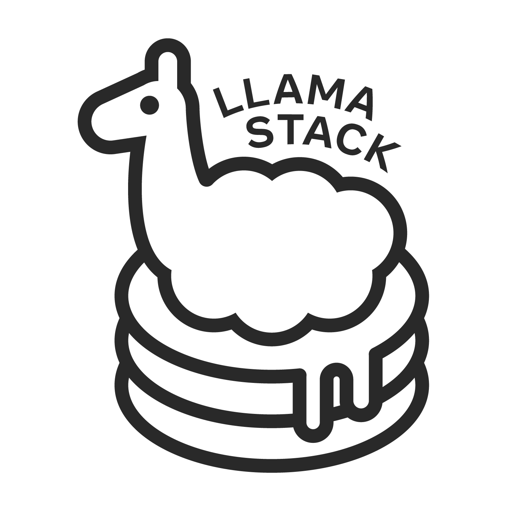

# llama-stack-apps

[](https://discord.gg/llama-stack)

This repo shows examples of applications built on top of [Llama Stack](https://github.com/meta-llama/llama-stack). Starting Llama 3.1 you can build agentic applications capable of:

- breaking a task down and performing multi-step reasoning.
- using tools to perform some actions
  - built-in: the model has built-in knowledge of tools like search or code interpreter
  - zero-shot: the model can learn to call tools using previously unseen, in-context tool definitions
- providing system level safety protections using models like Llama Guard.

> [!NOTE]
> The Llama Stack API is still evolving and may change. Feel free to build and experiment, but please don't rely on its stability just yet!


An agentic app requires a few components:
- ability to run inference on the underlying Llama series of models
- ability to run safety checks using the Llama Guard series of models
- ability to execute tools, including a code execution environment, and loop using the model's multi-step reasoning process

All of these components are now offered by a single Llama Stack Distribution. The [Llama Stack](https://github.com/meta-llama/llama-stack) defines and standardizes these components and many others that are needed to make building Generative AI applications smoother. Various implementations of these APIs are then assembled together via a **Llama Stack Distribution**.

## Getting started with the Llama Stack Apps

To get started with Llama Stack Apps, you'll need to:

1. Install prerequisites
3. Start a Llama Stack server
4. Connect your client agentic app to Llama Stack server

Once started, you can then just point your agentic app to the URL for this server (e.g. `http://localhost:5000`).

### 1. Install Prerequisites

**Python Packages**

We recommend creating an isolated conda Python environment.

```bash
# Create and activate a virtual environment
ENV=stack
conda create -n $ENV python=3.10
cd <path-to-llama-stack-apps-repo>
conda activate $ENV

# Install dependencies
pip install -r requirements.txt
```

This will install all dependencies required to (1) Build and start a Llama Stack server (2) Connect your client app to Llama Stack server.


### 2. Starting a Llama Stack Server
- Please see our [llama-stack](https://github.com/meta-llama/llama-stack) repo's [Developer Guide](https://github.com/meta-llama/llama-stack/blob/main/docs/developer_cookbook.md) for setting up a Llama Stack distribution and running server to serve API endpoints. You should have a server endpoint for building your client apps.

Once your your server started, you should have see outputs --
```
...
Serving POST /agentic_system/session/delete
Serving POST /agentic_system/session/get
Serving POST /agentic_system/step/get
Serving POST /agentic_system/turn/get
Serving GET /telemetry/get_trace
Serving POST /telemetry/log_event
Listening on :::5000
INFO:     Started server process [587053]
INFO:     Waiting for application startup.
INFO:     Application startup complete.
INFO:     Uvicorn running on http://[::]:5000 (Press CTRL+C to quit)
```

### 3. Test agents demo script

We have built sample demo scripts for interating with the Stack server.

With the server running, you may run to test out an simple Agent
```
python -m examples.agents.hello localhost 5000
```

You will see outputs of the form --
```
> created agents with agent_id=d050201b-0ca1-4abd-8eee-3cba2b8c0fbc
User> Hello
shield_call> No Violation
inference> How can I assist you today?
shield_call> No Violation
User> Which players played in the winning team of the NBA western conference semifinals of 2024, please use tools
shield_call> No Violation
inference> brave_search.call(query="NBA Western Conference Semifinals 2024 winning team players")
tool_execution> Tool:brave_search Args:{'query': 'NBA Western Conference Semifinals 2024 winning team players'}
tool_execution> Tool:brave_search Response:{"query": "NBA Western Conference Semifinals 2024 winning team players", "top_k": [{"title": "2024 NBA Western Conference Semifinals - Mavericks vs. Thunder | Basketball-Reference.com", "url": "https://www.basketball-reference.com/playoffs/2024-nba-western-conference-semifinals-mavericks-vs-thunder.html", "description": "Summary and statistics for the <strong>2024</strong> <strong>NBA</strong> <strong>Western</strong> <strong>Conference</strong> <strong>Semifinals</strong> - Mavericks vs. Thunder", "type": "search_result"}, {"title": "2024 NBA playoffs - Wikipedia", "url": "https://en.wikipedia.org/wiki/2024_NBA_playoffs", "description": "Aged 20 years and 96 days old, ... youngest <strong>player</strong> <strong>in</strong> <strong>NBA</strong> history to record 10+ points and 15+ rebounds in a playoff game, coming during game 6 of the Maverick&#x27;s <strong>Western</strong> <strong>Conference</strong> <strong>Semifinal</strong> <strong>win</strong> against the Thunder on May 18. The Timberwolves overcame a 20\u2013point deficit to <strong>win</strong> game 7 against the Nuggets, the largest game 7 comeback in <strong>NBA</strong> playoffs history. With the defending champion Nuggets losing to the Minnesota Timberwolves, the <strong>2024</strong> playoffs marked ...", "type": "search_result"}, {"title": "2024 NBA Playoffs | Official Bracket, Schedule and Series Matchups", "url": "https://www.nba.com/playoffs/2024", "description": "The official site of the <strong>2024</strong> <strong>NBA</strong> Playoffs. Latest news, schedules, matchups, highlights, bracket and more.", "type": "search_result"}]}
shield_call> No Violation
inference> The players who played in the winning team of the NBA Western Conference Semifinals of 2024 are not specified in the search results provided. However, the search results suggest that the Mavericks played against the Thunder in the Western Conference Semifinals, and the Mavericks won the series.
shield_call> No Violation
```

## Start an App and Interact with the Server

Now that the Stack server is setup, the next thing would be to run an agentic app using Agents APIs.

We have built sample scripts, notebooks and a UI chat interface ( using [Gradio]([url](https://www.gradio.app/)) ! ) to help you get started.

Start an app (local) and interact with it by running the following command:
```bash
PYTHONPATH=. python examples/agent_store/app.py localhost 5000
```
This will start a mesop app and you can go to `localhost:7860` to play with the chat interface.


Optionally, you can setup API keys for custom tools:
- [WolframAlpha](https://developer.wolframalpha.com/): store in `WOLFRAM_ALPHA_API_KEY` environment variable
- [Brave Search](https://brave.com/search/api/): store in `BRAVE_SEARCH_API_KEY` environment variable

You may see other ways of interating in [Agent Store README.md](https://github.com/meta-llama/llama-stack-apps/tree/registry/examples/agent_store)

## Create agentic systems and interact with the Stack server

NOTE: Ensure that Stack server is still running.

```bash
cd <path-to-llama-agentic-system>
conda activate $ENV
llama stack run <name> # If not already started

PYTHONPATH=. python -m examples.agents.rag_with_memory_bank localhost 5000
```

You should see outputs to stdout of the form --
```bash
Environment: ipython
Tools: brave_search, wolfram_alpha, photogen

Cutting Knowledge Date: December 2023
Today Date: 23 July 2024


User> I am planning a trip to Switzerland, what are the top 3 places to visit?
Final Llama Guard response shield_type=<BuiltinShield.llama_guard: 'llama_guard'> is_violation=False violation_type=None violation_return_message=None
Ran PromptGuardShield and got Scores: Embedded: 0.9999765157699585, Malicious: 1.1110752893728204e-05
StepType.shield_call> No Violation
role='user' content='I am planning a trip to Switzerland, what are the top 3 places to visit?'
StepType.inference> Switzerland is a beautiful country with a rich history, culture, and natural beauty. Here are three must-visit places to add to your itinerary: ....

```

> **Tip** You can optionally do `--disable-safety` in the scripts to avoid running safety shields all the time.


Feel free to reach out if you have questions.


## The Llama Stack Client SDK
- Check out our client SDKs for connecting to Llama Stack server, you can choose from [python](https://github.com/meta-llama/llama-stack-client-python), [node](https://github.com/meta-llama/llama-stack-client-node), [swift](https://github.com/meta-llama/llama-stack-client-swift), and [kotlin](https://github.com/meta-llama/llama-stack-client-kotlin) programming languages to quickly build your applications.


## Using VirtualEnv instead of Conda

> [!NOTE]
> While you can run the apps using `venv`, installation of a distribution requires conda.

#### In Linux

```bash
# Create and activate a virtual environment
python3 -m venv venv
source venv/bin/activate
```

#### For Windows

```bash
# Create and activate a virtual environment
python -m venv venv
venv\Scripts\activate  # For Command Prompt
# or
.\venv\Scripts\Activate.ps1  # For PowerShell
# or
source venv\Scripts\activate  # For Git
```

The instructions thereafter (including `pip install -r requirements.txt` for installing the dependencies) remain the same.
