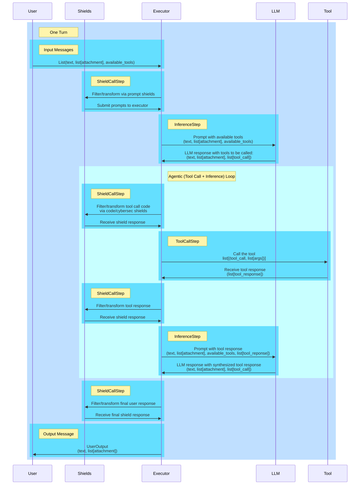

The sequence diagram with more details of the communication between components is below:

```mermaid


sequenceDiagram
    participant U as User
    participant S as Shields
    participant E as Executor
    participant L as LLM
    participant T as Tool
    rect rgb(191, 223, 255)
    note right of U: One Turn
        rect rgb(100, 223, 255)
        note right of U: Input Messages
            U->>E: List(text, list[attachment], available_tools)
        end
        rect rgb(100, 223, 255)
        note right of S: ShieldCallStep
            E->>S: Filter/transform via prompt shields
            S->>E: Submit prompts to executor
        end
        rect rgb(100, 223, 255)
        note right of E: InferenceStep
            E->>L: Prompt with available tools<br>(text, list[attachment], available_tools)
            L->>E: LLM response with tools to be called: <br>(text, list[attachment], list[tool_call])
        end

        rect rgb(200, 255, 255)
        note right of E: Agentic (Tool Call + Inference) Loop
            rect rgb(100, 223, 255)
            note right of S: ShieldCallStep
                E->>S: Filter/transform tool call code<br>via code/cybersec shields
                S->>E: Receive shield response
            end
            rect rgb(100, 223, 255)
            note right of E: ToolCallStep
                E->>T: Call the tool<br>list[(tool_call, list[args])]
                T->>E: Receive tool response<br>(list[tool_response])
            end
            rect rgb(100, 223, 255)
            note right of S: ShieldCallStep
                E->>S: Filter/transform tool response
                S->>E: Receive shield response
            end
            rect rgb(100, 223, 255)
            note right of E: InferenceStep
                E->>L: Prompt with tool response<br>(text, list[attachment], available_tools, list[tool_reponse])
                L->>E: LLM response with synthesized tool response<br>(text, list[attachment], list[tool_call])
            end
        end
        rect rgb(100, 223, 255)
        note right of S: ShieldCallStep
            E->>S: Filter/transform final user response
            S->>E: Receive final shield response
        end
        rect rgb(100, 223, 255)
        note right of U: Output Message
            E->>U: UserOutput<br>(text, list[attachment])
        end
    end
```
