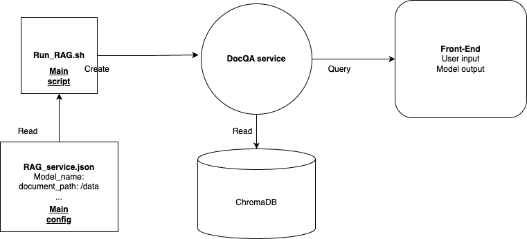

## DocQA

This is an end-to-end Retrieval Augmented Generation (RAG) App leveraging llama-stack that handles the logic for ingesting documents, storing them in a vector database and providing an inference interface.

We share the details of how to run first and then an outline of how it works:

### Prerequisite:

Install docker: Check [this doc for Mac](https://docs.docker.com/desktop/setup/install/mac-install/), [this doc for Windows](https://docs.docker.com/desktop/setup/install/windows-install/) and this [instruction for Linux](https://docs.docker.com/engine/install/).

For Mac and Windows users, you need to start the Docker app manually after installation.

### How to run the pipeline:



The above is the workflow diagram for this RAG app. To run the app, please read the following instructions:

1. Copy the template configuration file `docqa_env_template` to create your own `docqa_env` inside the docker folder:

```bash
cd docker
cp docqa_env_template docqa_env
```

2. Then update `model_name` and `document_path` accordingly in your `docqa_env`, for example:

```
DOC_PATH=/path/to/your/llama-stack-apps/examples/DocQA/example_data
MODEL_NAME=llama3.2:1b-instruct-fp16
HOST=localhost
LLAMA_STACK_PORT=5000
CHROMA_PORT=6000
GRADIO_SERVER_PORT=7860
USE_GPU_FOR_DOC_INGESTION=false
```

3. In the `docker` folder, run following code:

```bash
bash run_RAG.sh
```

4.  Once the service is ready, open the link http://localhost:7861/ in your browser to chat with your documents.

### Overview of how the RAG app works:

1. We use [docling](https://github.com/DS4SD/docling) framework for handling multiple file input formats (PDF, PPTX, DOCX)
2. If you are using a GPU, we have an option to use `Llama-3.2-11B-Vision` to caption images in the documents. On a CPU-only machine this step is skipped.
3. Once ingested, we use a llama-stack distribution running chroma-db and `Llama-3.2-3B-Instruct` to ingest chunks into a memory_bank
4. Once the vectordb is created, we then use llama-stack with the `Llama-3.2-3B-Instruct` to chat with the model.
