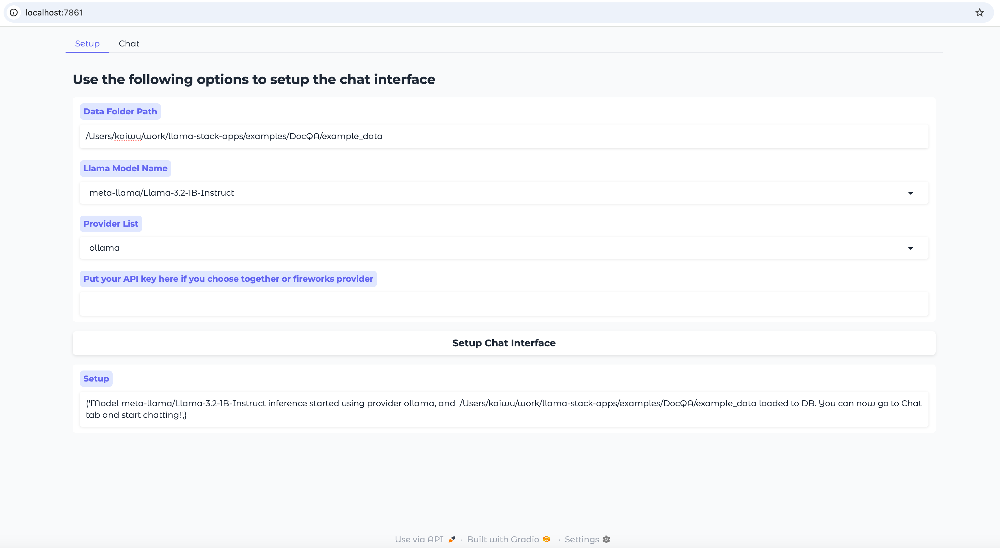
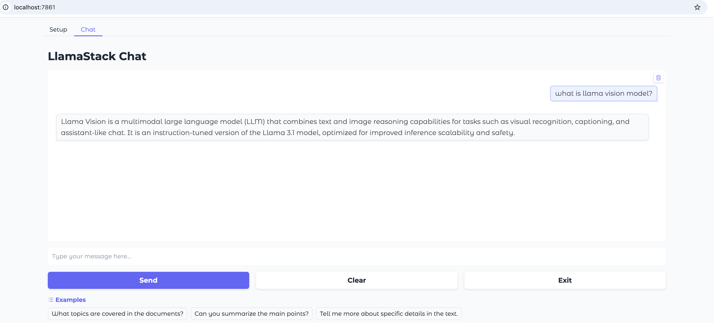
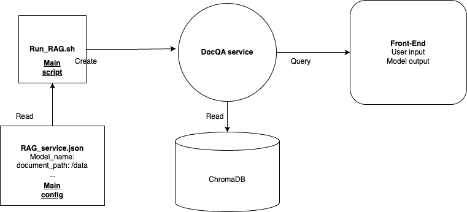

# DocQA

This is an end-to-end Retrieval Augmented Generation (RAG) app example, leveraging llama-stack that handles the logic for ingesting documents, storing them in a vector database and providing an inference interface.

In this example, we demonstrated two implementations:

1. `MacQA` app is only build for MacOS arm64 platform where you can install the app to your Application folder from the dmg file.
2. `DockerQA` pipeline is based on [Docker](https://www.docker.com/) so it can run in any system that supports Docker service.

Please check out the MacQA section and DockerQA section below for more details.

## MacQA

### Prerequisite:

You can either do local inference with Ollama or choose a cloud provider:

**Local Inference**:

If you want to use Ollama to run inference, please follow [Ollama's download instruction](https://ollama.com/download) to install Ollama.  Before running the app, please open Ollama software and download the model you want to use, eg. type `ollama pull llama3.2:1b-instruct-fp16` in terminal. Only 1B, 3B and 8B model are supported as most machine can not run models bigger than 8B locally.

**Cloud API**:

Register an account in TogetherAI or FireworksAI to get an API key.

### How to run MacQA app:

1. To get the dmg file, you can just download raw file from [here](https://github.com/meta-llama/llama-stack-apps/blob/mac-rag/examples/DocQA/MacQA.dmg) or use git clone by first following instructions [here](https://docs.github.com/en/repositories/working-with-files/managing-large-files/installing-git-large-file-storage) to enable git lfs and do another `git pull`.
2. Open the `MacQA.dmg` in the folder and move `MacQA.app` to Application folder to have it installed.

3. Double click `MacQA.app` in the Application folder.
4. Open `http://localhost:7861/`, then type the path of data folder then select the models and providers. Put your API key if you choose to use TogetherAI or FireworksAI, as shown below:



5. Wait for the setup to be ready and click `Chat` tab to start chating to this app, as shown below:



6. Use `Activity Monitor` to quit the `MacQA.app`.

### How to build the MacQA app:

1. Create a new python venv, eg. `conda create -n build_app python=3.10` and then `conda activate build_app` to use it.
2. Run `pip install -r build_app_env.txt` to install required pypi packages.
3. Run `python MacQA.py` make sure everything works.
4. UPX is a executable packer to reduce the size of our App, we need to download UPX zip corresponding to your machine platform from [UPX website](https://github.com/upx/upx/releases/) to this folder and unzip it.
5. Compile MacQA.py with correct upx path, eg. `pyinstaller --upx-dir ./upx-4.2.4-arm64_linux MacQA.spec`, the one-clickable app should be in `./dist/MacQA.app` (This step may take ~10 mins).
6. Optionally, you can move the MacQA.app to Application folder to have it locally installed.
7. Alternatively, if you want to create a .dmg file for easier distribution. You can follow those steps:

 - Copy ./dist/MacQA.app to a new folder.
 -  In your Mac, search and open Disk Utility -> File -> New Image -> Image From Folder.
 - Select the folder where you have placed the App. Give a name for the DMG and save. This creates a distributable image for you.

The current `MacQA` app is built for MacOS arm64 platform. To build the app for other platform, you can follow the [Pyinstaller documentation](https://pyinstaller.org/en/stable/usage.html#) to make modifications on `MacQA.spec` and rebuild.

## DockerQA

### Prerequisite:

Install docker: Check [this doc for Mac](https://docs.docker.com/desktop/setup/install/mac-install/), [this doc for Windows](https://docs.docker.com/desktop/setup/install/windows-install/) and this [instruction for Linux](https://docs.docker.com/engine/install/).

For Mac and Windows users, you need to start the Docker app manually after installation.

### How to run the pipeline:



The above is the workflow diagram for this RAG app. To run the app, please read the following instructions:

1. Copy the template configuration file `docqa_env_template` to create your own `docqv_env` inside the docker folder:

```bash
cd docker
cp docqa_env_template docqv_env
```

2. Then update `model_name` and `document_path` accordingly in your `docqv_env`, for example:

```
DOC_PATH=/path/to/your/llama-stack-apps/examples/DocQA/example_data
MODEL_NAME=llama3.2:1b-instruct-fp16
HOST=localhost
LLAMA_STACK_PORT=5000
CHROMA_PORT=6000
GRADIO_SERVER_PORT=7860
USE_GPU_FOR_DOC_INGESTION=false
```

3. In the `docker` folder, run following code:

```bash
bash run_RAG.sh
```

4.  Once the service is ready, open the link http://localhost:7861/ in your browser to chat with your documents.

### Overview of how the RAG app works:

1. We use [docling](https://github.com/DS4SD/docling) framework for handling multiple file input formats (PDF, PPTX, DOCX)
2. If you are using a GPU, we have an option to use `Llama-3.2-11B-Vision` to caption images in the documents. On a CPU-only machine this step is skipped.
3. Once ingested, we use a llama-stack distribution running chroma-db and `Llama-3.2-3B-Instruct` to ingest chunks into a memory_bank
4. Once the vectordb is created, we then use llama-stack with the `Llama-3.2-3B-Instruct` to chat with the model.
