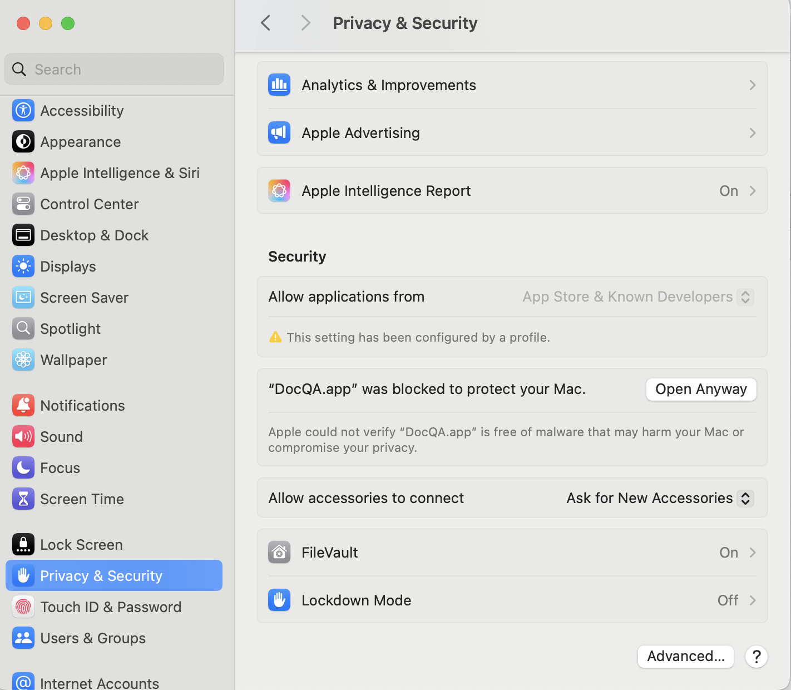
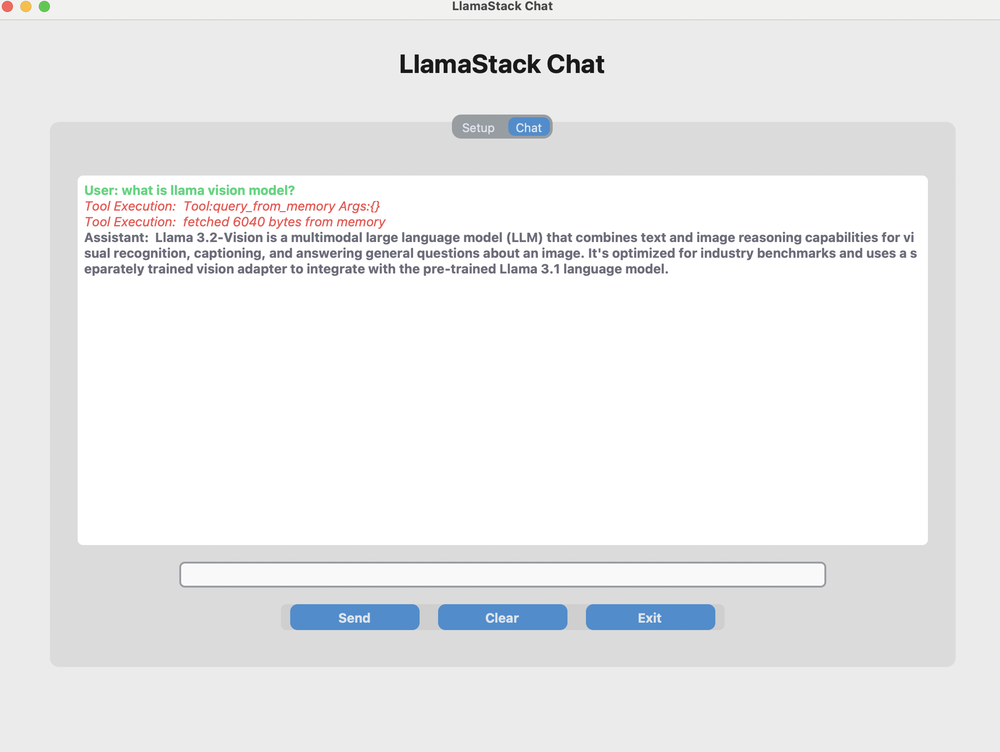

# DocQA

This is an end-to-end Retrieval Augmented Generation (RAG) app example, leveraging llama-stack that handles the logic for ingesting documents, storing them in a vector database and providing an inference interface.

`DocQA` app is only build for MacOS arm64 platform where you can install the app to your Application folder from the dmg file.

### Prerequisite:

You can either do local inference with Ollama or choose a cloud provider:

**Local Inference**:

If you want to use Ollama to run inference, please follow [Ollama's download instruction](https://ollama.com/download) to install Ollama.  Before running the app, please open Ollama software and download the model you want to use, eg. use the command `ollama pull llama3.2:1b-instruct-fp16` in terminal. Only 1B, 3B and 8B model are supported as most machine can not run models bigger than 8B locally.

**Cloud Provider**:

Register an account in [TogetherAI](https://www.together.ai/) or [FireworksAI](https://fireworks.ai/) to get an API key.

### How to run DocQA app:

1. To get the dmg file, you can just download raw file from [here](https://github.com/meta-llama/llama-stack-apps/blob/docqav2/examples/DocQA/DocQA.dmg) or use git clone by first following instructions [here](https://docs.github.com/en/repositories/working-with-files/managing-large-files/installing-git-large-file-storage) to enable git lfs and do another `git pull`.

2. Open the `DocQA.dmg` in the folder and move `DocQA.app` to Application folder to have it installed.
(If you see this warning pops up and stops you from installing the app:

You need to open `System Settings` -> `Privacy & Security` -> Choose `Open Anyway`, shown here: 

Please check [this documentation](https://support.apple.com/en-us/102445) for more details on how to bypass this warning and install.)

3. Double click `DocQA.app` in the Application folder.

4. Choose your data folder then select the models and providers. Put your API key if you choose to use TogetherAI or FireworksAI, as shown below:

5. Wait for the setup to be ready and click `Chat` tab to start chating to this app, as shown below:

6. Click `exit` button to quit the app.

### How to build the DocQA app:

1. Create a new python venv, eg. `conda create -n build_app python=3.10` and then `conda activate build_app` to use it.
2. Run `pip install -r build_app_env.txt` to install required pypi packages.
3. Run `python app.py` make sure everything works.
4. UPX is a executable packer to reduce the size of our App, we need to download UPX zip corresponding to your machine platform from [UPX website](https://github.com/upx/upx/releases/) to this folder and unzip it.
5. We will use Pyinstaller to build the app from `app.py` file. Please use it with correct upx path, eg. `pyinstaller --upx-dir ./upx-4.2.4-arm64_linux DocQA.spec`, the one-clickable app should be in `./dist/DocQA.app` (This step may take ~10 mins).
6. Optionally, you can move the DocQA.app to Application folder now to have it locally installed.
7. Alternatively, if you want to create a .dmg file for easier distribution. You can follow those steps:

 - Copy ./dist/DocQA.app to a new folder.
 -  In your Mac, search and open Disk Utility -> File -> New Image -> Image From Folder.
 - Select the folder where you have placed the App. Give a name for the DMG and save. This creates a distributable image for you.

The current `DocQA` app is built for MacOS arm64 platform. To build the app for other platform, you can follow the [Pyinstaller documentation](https://pyinstaller.org/en/stable/usage.html#) to make modifications on `DocQA.spec` and rebuild.
