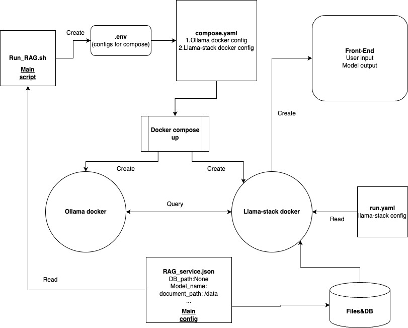

## E2E-RAG-App

This is an End to End RAG App leveraging llama-stack that handles the logic for ingesting documents, storing them in a vector db and providing an inference interface.

We share the details of how it works first and then detailed steps on how to run below:

All of the steps are run using a single-step via docker script.

Overview of how it works:
1. We use [docling](https://github.com/DS4SD/docling) framework for handling multiple file input formats (PDF, PPTX, DOCX)
2. If you are using a GPU inference machine, we have an option to use `Llama-3.2-11B-Vision` to caption images in the documents, on CPU machine this step is skipped
3. Once ingested, we use a llama-stack distribution running chroma-db and `Llama-3.2-3B-Instruct` to ingest chunks into a memory_bank
4. Once the vectordb is created, we then use llama-stack with the `Llama-3.2-3B-Instruct` to chat with the model.



How to run:
Install docker according to this [web page](https://docs.docker.com/engine/install/).

1. We have main config `RAG_service.json` , please change `model_name` and `document_path` accordingly.
2. `run_RAG.sh` is the main script that can create `.env` file for compose.yaml and then actually start the `docker compose`. `compose.yaml` is the main docker yaml that specifies all the mount option and docker configs, change the mounts if needed.

```bash
cd docker
bash run_RAG.sh
``1

3. Ollama docker will start and this docker will pull and run the llama model specified. The `ollama_start.sh` control the Ollama docker startup behavior, change it if needed. You can log into the docker by

```bash
docker exec -it docker-ollama-1 bash
```

4. Llama-stack docker will start as well. The `llama_stack_start.sh` control the docker startup behavior, change it if needed. (As we have not yet have a working llama-stack docker image, this `llama_stack_start.sh` currently on-the-fly install llama-stack from source) It should be able to run llama-stack server based on the  `llama_stack_run.yaml` config. Once the server is ready, then it will run the `rag_main.py`.

