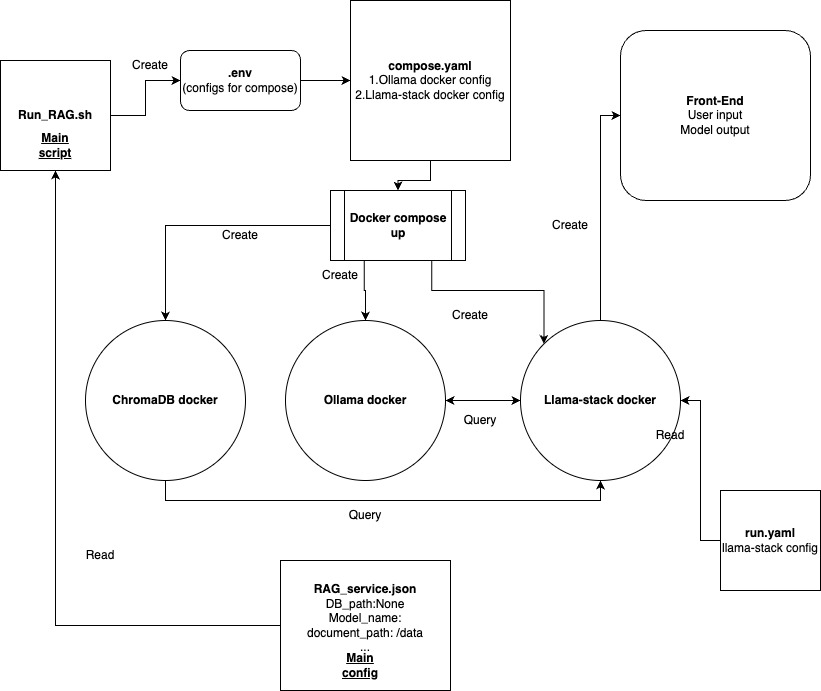

## E2E-RAG-App

This is an E2E RAG App that can be pointed to any folder to do RAG over a collection of mixed file formats and do retrieval using the `Llama-3.2-3B-Instruct` Model

Details:
TODO:
1. Save memory_bank to local, and load it to local
2. Make the chat inference multi-turn
3. Front-end + docker

To run the `ingestion_script.py` script, please make sure there is a /DATA and /OUTPUT folder at its relative root. It will ingest ALL documents in /DATA and output BOTH markdown and JSON dump in /OUTPUT folder




How to run:
Install docker according to this [web page](https://docs.docker.com/engine/install/).
1. We have main config `RAG_service.json` , please change `model_name` and `document_path` accordingly.
2. `run_RAG.sh` is the main script that can create `.env` file for compose.yaml and then actually start the `docker compose`. `compose.yaml` is the main docker yaml that specifies all the mount option and docker configs, change the mounts if needed.

```bash
cd docker
bash run_RAG.sh
```

3. Ollama docker will start and this docker will pull and run the llama model specified. The `ollama_start.sh` control the Ollama docker startup behavior, change it if needed. You can log into the docker by

```bash
docker exec -it docker-ollama-1 bash
```

4. Llama-stack docker will start as well. The `llama_stack_start.sh` control the docker startup behavior, change it if needed. (As we have not yet have a working llama-stack docker image, this `llama_stack_start.sh` currently on-the-fly install llama-stack from source) It should be able to run llama-stack server based on the  `llama_stack_run.yaml` config. Once the server is ready, then it will run the `rag_main.py`.
