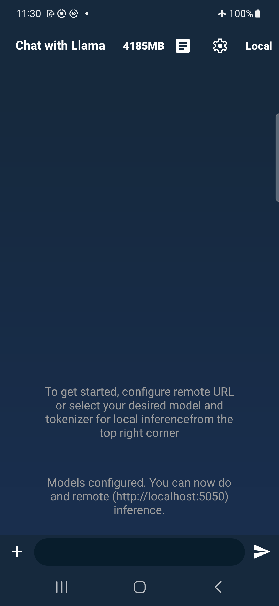
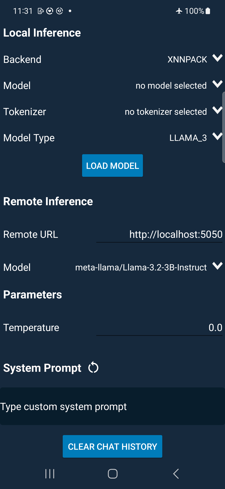

# Llama Stack Android Demo App

We’re excited to share this Android demo app using both remote and local Llama Stack features! The primary goal of this app is to showcase how to easily build Android apps with Llama models using Llama Stack SDKs in a chat app setup.

This app serves as a valuable resource to inspire your creativity and provide foundational code that you can customize and adapt for your particular use case.

Please dive in and start exploring our demo app today! We look forward to any feedback and are excited to see your innovative ideas to build agentic apps with Llama models. The current demo app is built using both Java and Kotlin. The majority of the activities are built with Java but the interfacing with Llama Stack APIs are in Kotlin. 

NOTE: The current app release is intended to work with Llama Stack Kotlin SDK v0.0.54 and Llama Stack v0.0.54. We haven’t tested other versions or combinations. 


## Key Concepts
From this demo app, you will learn many key concepts such as:
* Building a GenAI Android app with Llama Stack libraries
* Run inference with Llama Stack Kotlin SDK remotely (via various adapters) and on-device (via ExecuToch with XNNPACK)
* Use Llama model’s tool-calling features
* Local memories for conversational history

The goal is for you to see the type of support Llama Stack Kotlin SDK provides and feel comfortable with leveraging it for your use cases.

## Supporting Models
As a whole, the models that this app supports vary by remote or on-device/local.

For remote, the app should support whatever [Llama Stack](https://github.com/meta-llama/llama-stack) server supports. From feather Llama models such as 1B to the most comprehensive 405B. 

For on-device, here is the list of models we support currently and growing:
* Llama 3.2 Quantized 1B/3B
* Llama 3.2 1B/3B in BF16
* Llama 3.1 8B quantized
* Llama 3 8B quantized


## Building and Run the Demo App
1. Clone the repo
2. Open the project in Android Studio
3. Add .aar file for local inference: Use and download the `download-prebuilt-et-lib.sh` script file from the [llama-stack-client-kotlin-client-local](https://github.com/meta-llama/llama-stack-client-kotlin/blob/release/0.0.54/llama-stack-client-kotlin-client-local/download-prebuilt-et-lib.sh) directory to your local machine. Place the script in the top level of your Android app where the `app/` directory resides.

```
# downloads the executorch.aar and places it in the newly created directory app/libs
sh download-prebuilt-et-lib.sh
```
4. Wait until the gradle sync finished or in File -> `Sync Project with Gradle Files`
5. Attach your mobile phone with ADB available
6. Run the app (^R). This builds and launches the app on the phone

The demo app automatically downloads Llama Stack Kotlin SDK from Maven based on this configuration in `build.gradle.kts`: 

```
implementation("com.llama.llamastack:llama-stack-client-kotlin:0.0.54")
```


## How to Use the App

This section will provide the main steps to use the app.

### Opening the App

Below are the UI features for the app. It is a chat style app where users can have conversations with the selected models.
 On the top of the view we feature:
* Current total memory usage indicator (total usage by the system)
* Logs
* Gear icon - Settings including model selection, parameters etc.
* Mode selection - Click to flip between Local v.s. Remote

On the bottom of the view we feature:
* Multimedia selection for Image reasoning (Feature Work-in-progress)
* Textfield for input
* Send button

<p align="center">

</p>


### Settings

Within the Settings page, you can configure local model usage and remote host endpoint.

For local or on-device inference:
* First, assuming you have the model and tokenizer ready in ExecuTorch format. You can get more detail [here](https://github.com/pytorch/executorch/blob/main/examples/demo-apps/android/LlamaDemo/docs/delegates/xnnpack_README.md#prepare-models) on how to prepare them. Once you have the model and tokenizer ready, you can push them to the device by:
```
adb shell mkdir -p /data/local/tmp/llama
adb push llama.pte /data/local/tmp/llama
adb push tokenizer.bin /data/local/tmp/llama
```
* Then, select the appropriate Backend(XNNPACK on CPUs), Model, Tokenizer and Model Type
* Click `Load Model` and this will take you back to the main chatting page
* Make sure the mode selector is in `Local`.  Otherwise if you see `Remote` tap it to switch to `Local`.

For remote inference:
* Launch a Llama Stack server on localhost (we used fireworks and hf-serverless as the distributor) - [Tutorial](https://github.com/meta-llama/llama-stack-client-kotlin/tree/release/0.0.54?tab=readme-ov-file#setup-remote-inferencing)
* On another terminal window, `adb reverse tcp:5050 tcp:5050` where 5050 is the port number, change this to whichever one you use/create in your main llama stack flow
* Select your Model under the Remote Inference section. For example: meta-llama/Llama-3.2-3B-Instruct
* Provide the Llama Stack server endpoint in Remote URL. For example: http://localhost:5050
* Go back to the main page 
* Tap `Local` text button on the top right corner to switch mode to `Remote`

Optional Parameters:
* Temperature (0.0-2.0): Defaulted to 0, you can adjust the temperature for the model as well. In local mode, the model will automatically reload upon any adjustments. In remote mode, no reload needed.
* System Prompt: Without any formatting, you can enter in a system prompt. For example, "you are a travel assistant" or "give me a response in a few sentences". Without providing any system prompt will result in the app using default system prompt which is currently set for tool calling capability. 

<p align="center">

</p>


### User Prompt
Once the model is successfully loaded then enter any prompt and click the send (i.e. generate) button to send it to the model.

You can provide more follow-up questions as well. The current application stores 2 rounds of previous conversations as memory. This can be adjusted with the constant `CONVERSATION_HISTORY_MESSAGE_LOOKBACK`. Since it will append message history as part of the new prompt, this will affect your time-to-first-token. For local inference, the prefill rate is usually smaller than remote inference, which means the model takes longer to process the input prompt. We recommend 2 rounds of conversation history for local inference as a moving window approach.

To understand more about how we are running the inference, check the sample code in `LlamaStackLocalInference.kt` or `LlamaStackRemoteInference.kt`


### Tool Calling
In this demo app, we also showcase a tool calling example to ask the model to help schedule calendar events with the default Android Calendar app. This is done by supplying a “special” system prompt to have the model detect the user's intention and match it to customized tools or functions provided. In our example, we defined a function called `createCalendarEvent` and the criteria to invoke it. You can learn more and define your own function in `AvailableFunction.kt`.

When using the demo app, you can chat with the model like normal. 

<p align="center">

</p>

However, when you have intention to create a meeting or events, the model helps you add a reminder in the Calendar App.

<p align="center">

</p>

Whenever the model is going to make a tool-calling, the Llama Stack Kotlin API will return details in
```
val toolCalls = result.asChatCompletionResponse().completionMessage().toolCalls()
```

This feature works on devices that don’t require a Google account login to use the device. There is a known issue where if you test on a device that requires a Google account (like the Pixel 8 Pro) then the event will not be created.

For feather Llama models such as 1B and 3B Instruct, they only support customized tools. For bigger Llama models, you can also use built-in tools such as Brave Search. More detail about tool calling can be found on Llama official website [here](https://www.llama.com/docs/model-cards-and-prompt-formats/llama3_2)

### Agents
Llama Stack Kotlin SDK also offers agentic components such as MemoryBank for building your agentic app. You can also integrate the tool calling feature with Agents. However, there is a known issue about streaming with remote inference we are fixing. Once fixed, we will build more Agent examples.


## Reporting Issues
If you encountered any bugs or issues following this tutorial please file a bug/issue here on [Github](https://github.com/meta-llama/llama-stack-apps/issues/).

