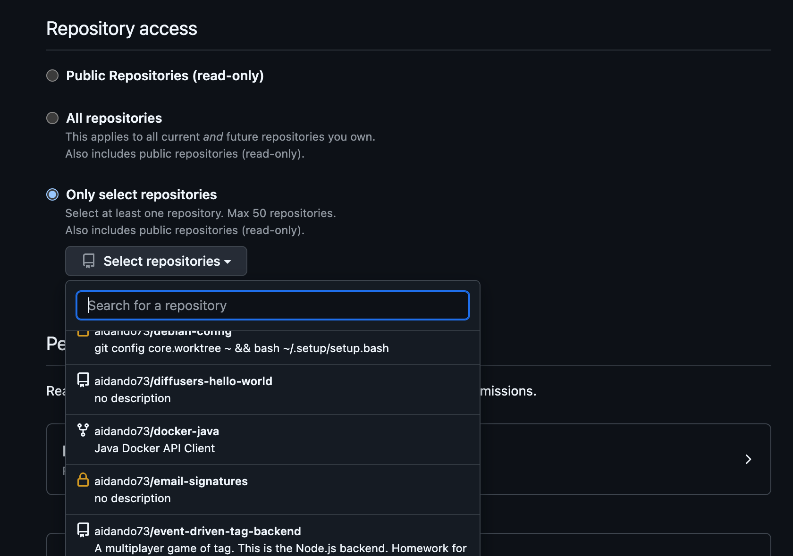
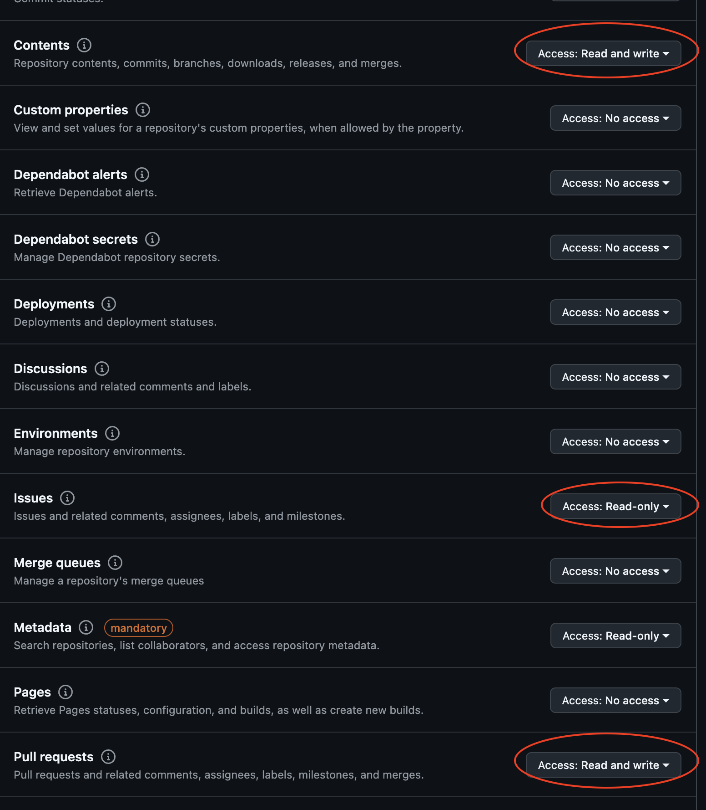

# GitHub Coding Agent

This is a coding agent that can read a GitHub issue, write code and submits a PR with a fix. It currently performs 5% on [SWE-Bench lite](https://www.swebench.com/). Demo:

https://github.com/user-attachments/assets/1c579e25-7630-404c-8ce5-1b72c2a22c1c

## What You Need
- A GitHub account
- git installed on your computer
- Python 3.10

## Setup Steps

1. Start Llama Stack:

This uses the fireworks distribution of Llama Stack, but will work with any other distribution that supports 3.3 70B model (405b support coming soon).
```bash
export LLAMA_STACK_PORT=5000
export FIREWORKS_API_KEY=your_key_here
docker run -it \
  -p $LLAMA_STACK_PORT:$LLAMA_STACK_PORT \
  -v ~/.llama:/root/.llama \
  llamastack/distribution-fireworks \
  --port $LLAMA_STACK_PORT \
  --env FIREWORKS_API_KEY=$FIREWORKS_API_KEY
```

2. Get a GitHub token:
    - Go to https://github.com/settings/personal-access-tokens/new
    - Enter a name
    - Pick which repositories it has access to

    - Give it these permissions:

    - Create the token and copy it
3. Setup your .env file:
```bash
cp .env.example .env
```
Then open `.env` and add your GitHub token:
```
GITHUB_API_KEY=github_pat_11SDF...
```

4. Create a virtual environment:
```bash
# python -m venv .venv should also work here as well but this is only tested on python 3.10
conda create -n llama-stack-coding-agent python=3.10
conda activate llama-stack-coding-agent
```

5. Install the dependencies:

```bash
pip install -r requirements.txt
```

6. Start the agent:
```bash
python -m llama_agent.main --issue-url your_github_issue_url

# For example:
# python -m llama_agent.main --issue-url https://github.com/example-user/example-repo/issues/34
```

## What It Does
- Reads GitHub issues
- Clones the repository under `sandbox/`
- Creates a fix locally
- Makes a new branch
- Submits a Pull Request with the fixes
- If it can't fix something, it leaves a comment explaining why
- Only supports Llama 3.3 70B at the moment

## Is It Safe?

Yes - the LLM:

- Doesn't have access to git tools or GitHub API (regular logic makes git commands)
- Doesn't execute any commands or arbitrary code
- Only works in a sandbox folder
- Won't push to your main branch
- Only creates new branches
- Won't close or merge Pull Requests
- Can't close/edit issues

## Evaluation results
This currently performs 5% on SWE-Bench lite using Llama 3.3 70B; There are a lot of opportunities for improvement. See the evaluation results here: https://huggingface.co/datasets/aidando73/llama-codes-swe-bench-evals/tree/main.
