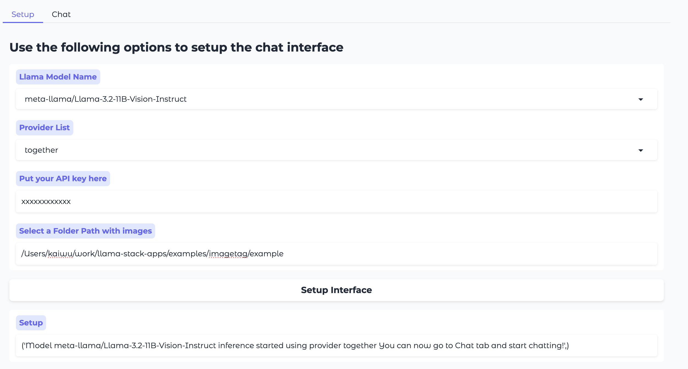

# Product Tagging app
This app creates a system for extracting structured metadata from product images and associated text.

## Goal
Create a llama-stack standalone application that can generate metadata from user-specified folder of images through UI and allow user now can input the query in the UI and the app will use the stored metadata to retrieve the images

Create an eval pipeline that can demonstrate the effectiveness and correctness of this application.


## Workflow:

1. Find dataset of image products with tag and download it into a folder
2. Use llama-stack post-training API to finetune the 11B vision model, following this notebook. (Optional)
3. Given a folder path of images, use llama-stack vllm backend to batch tag all images with 11B vision model.
4. Index and store the tags in the json file as DB
5. Create a Gradio UI that allows users to submit text query or text+ image query, like ‘find me a product similar to this image’ with an image  or   ‘find me a product in this category’
6. Retrieve images and show them on Gradio UI,  when users make queries (How to get the ground truth?)


## How to run:
```
python app.py
```




