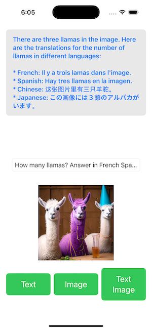
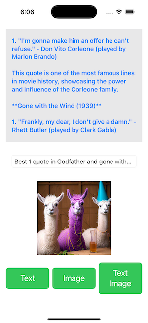

# iOSQuickDemo

iOSQuickDemo is a demo app ([video](https://drive.google.com/file/d/1X6rohq9PhVqzqWDtVKdGEhMpWaiTp79D/view?usp=sharing)) that shows how to use the Llama Stack Swift SDK ([repo](https://github.com/meta-llama/llama-stack-client-swift)) and its `ChatCompletionRequest` API with a Llama Stack server to perform remote text and image inference with Llama 3.1/3.2.




## Installation

The quickest way to try out the demo for remote inference is using Together.ai's Llama Stack distro at https://llama-stack.together.ai - you can skip the next section and go to the Build and Run the iOS demo section directly.

## (Optional) Build and Run Own Llama Stack Distro

You need to set up a remote Llama Stack distributions to run this demo. Assuming you have a [Fireworks](https://fireworks.ai/account/api-keys) or [Together](https://api.together.ai/) API key, which you can get easily by clicking the link above:

```
conda create -n llama-stack python=3.10
conda activate llama-stack
pip install --no-cache llama-stack==0.1.6 llama-models==0.1.6 llama-stack-client==0.1.6
```

Then, either:
```
PYPI_VERSION=0.1.6 llama stack build --template together --image-type conda
export TOGETHER_API_KEY="<your_together_api_key>"
llama stack run together
```
or
```
PYPI_VERSION=0.1.6 llama stack build --template fireworks --image-type conda
export FIREWORKS_API_KEY="<your_fireworks_api_key>"
llama stack run fireworks
```

The default port is 5000 for `llama stack run` and you can specify a different port by adding `--port <your_port>` to the end of "llama stack run fireworks|together".

## Build and Run the iOS demo

1. Double click `iOSQuickDemo/iOSQuickDemo.xcodeproj` to open it in Xcode.

2. Either replace "YOUR_TOGETHER_API_KEY" in `ContentView.swift` with your key (you can get a free trial key in seconds at https://api.together.ai):
```
let inference = RemoteInference(url: URL(string: "https://llama-stack.together.ai")!, apiKey: "YOUR_TOGETHER_API_KEY")
```

Or replace the line above with the host IP and port of the remote Llama Stack distro (e.g. http://localhost:5000) in Build and Run Own Llama Stack Distro:

```
let inference = RemoteInference(url: URL(string: "https://localhost:5000")!)
```

**Note:** In order for the app to access the remote URL, the app's `Info.plist` needs to have the entry `App Transport Security Settings` with `Allow Arbitrary Loads` set to YES.

3. Build the run the app on an iOS simulator or your device. Then click the Inference button, optionally after entering your own Question, to see the Llama answer. See the demo video [here](https://drive.google.com/file/d/1HnME3VmsYlyeFgsIOMlxZy5c8S2xP4r4/view?usp=sharing).

Note: For your first-time build, you may need to Enable and Trust the OpenAPI Generator plugin. A link to enable will be available in the logs. You may need to do a clean build, close Xcode and then restart it again to avoid any cache issues. Otherwise, you may see "Bad Access too URLSession" errors during inference.


## Implementation Note

The Llama Stack `chatCompletion` API is used for the inference. Its paramater `request` requires three parameters: a list of messages, the model id, and the stream setting. A `UserMessage`'s `content` contains the user text input inside `TextContentItem`.

### Text Inference

Inside the async return of the `chatCompletion`, each returned text chunk is appended to the message as the answer to the user input question.

```swift
for await chunk in try await inference.chatCompletion(
    request:
        Components.Schemas.ChatCompletionRequest(
        model_id: "meta-llama/Llama-3.1-8B-Instruct",
        messages: [
            .user(
            Components.Schemas.UserMessage(
                role: .user,
                content:
                    .case1(userInput)
                )
            )
        )
        ],
        stream: true)
    ) {
        switch (chunk.event.delta) {
        case .text(let s):
            message += s.text
            break
        case .image(let s):
            print("> \(s)")
            break
        case .tool_call(let s):
            print("> \(s)")
            break
        }
    }
```

### Image Inference

Using model "meta-llama/Llama-3.2-11B-Vision-Instruct", you can compose UserMessage with an image URL or an image URL plus a user input text as follows:

```swift
private func userMessageToDescribeAnImage(_ imageURL: String) -> Components.Schemas.UserMessage {
return Components.Schemas.UserMessage(
    role: .user,
    content:
    .InterleavedContentItem(
        .image(Components.Schemas.ImageContentItem(
        _type: .image,
        image: Components.Schemas.ImageContentItem.imagePayload( url: Components.Schemas.URL(uri: imageURL))
        )
        )
    )
)
}

private func userMessageWithTextAndImage(_ imageURL: String, _ text: String) -> Components.Schemas.UserMessage {
return Components.Schemas.UserMessage(
    role: .user,
    content:
    .case3([
        Components.Schemas.InterleavedContentItem.text(
        Components.Schemas.TextContentItem(
            _type: .text,
            text: text
        )
        ),
        Components.Schemas.InterleavedContentItem.image(
        Components.Schemas.ImageContentItem(
            _type: .image,
            image: Components.Schemas.ImageContentItem.imagePayload( url: Components.Schemas.URL(uri: imageURL))
            )
        )
        ])
    )
}
```

To use a local image on iOS, convert the image to `Base64EncodedData` then compose the user image using `data` instead of `url`:

```swift
func base64EncodedImage(named imageName: String, withExtension ext: String) -> Base64EncodedData? {
  guard let imageUrl = Bundle.main.url(forResource: imageName, withExtension: ext) else {
      print("Image not found in bundle")
      return nil
  }

  guard let imageData = try? Data(contentsOf: imageUrl) else {
      print("Unable to load image data")
      return nil
  }

  let base64Data = imageData.base64EncodedData()

  return Base64EncodedData(base64Data)
}

private func userMessageToDescribeALocalImage() -> Components.Schemas.UserMessage {
return Components.Schemas.UserMessage(
    role: .user,
    content:
    .InterleavedContentItem(
        .image(Components.Schemas.ImageContentItem(
        _type: .image,
        image: Components.Schemas.ImageContentItem.imagePayload( data: base64EncodedImage(named: "Llama_Repo", withExtension: "jpeg"))
        )
        )
    )
)
}
```

For a more advanced demo using the Llama Stack Agent API and custom tool calling feature, see the [iOS Calendar Assistant demo](https://github.com/meta-llama/llama-stack-apps/tree/main/examples/ios_calendar_assistant).
